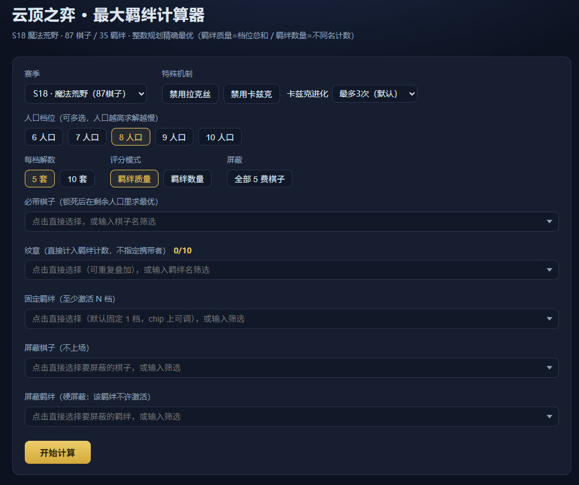

# TFT Max-Synergies Calculator

[English](README.md) | [简体中文](README.zh-CN.md)

Given a board size (levels 6–10), find the composition that **maximizes active trait value** from the
current set's unit pool, with rich constraints (must-include/banned units, banned/pinned traits,
emblems) and two scoring modes. Solving is an **exact integer program** (glpk.js — a WASM build of
GLPK): results are provably optimal, not heuristic. Same idea as
[tactics.tools' perfect-synergies](https://tactics.tools/zh/perfect-synergies), generalized.



Current data: **Set 18 "Enchanted Wilds / 魔法荒野"** (source:
[CommunityDragon](https://raw.communitydragon.org/latest/cdragon/tft/zh_cn.json), zh_CN locale names).

## Features

- **Two scoring modes** (switchable): *tier sum* (default — every breakpoint a trait reaches counts
  as one tier; a trait at tier 2 scores 2) and *distinct trait count* (a trait counts once however
  many tiers it hits).
- **Constraint system**: must-include units (lock, optimize the rest) · ban any units · one-click
  ban all 5-costs · **hard-ban traits** (the trait may not activate at all) · **pin a trait to at
  least N tiers**.
- **Emblems** (up to 10): fixed team-level trait counts, no carrier needed.
- **Multiple solutions**: 5 (default) or 10 comps per level, ordered by score desc, then total unit
  cost **expensive-first** among ties.
- **Set mechanics modeling**: exclusive form groups (Lux), evolving units (Kha'Zix), multi-slot /
  multi-count units (Elder Dragon), simplified special traits (Rival) — all declared in one
  per-set rules file, compiled into season-agnostic data.
- **Three frontends**: Web UI, CLI, and HTTP API — all sharing the same solver core.
- **New sets via one command**: extraction pipeline downloads CommunityDragon data and compiles
  everything (including special-unit rules) automatically.

## Quick start

```bash
npm install
npm run serve          # Web UI at http://localhost:8080
```

```bash
node cli.js                       # CLI: levels 6-10, 5 comps per level
node cli.js --levels 8 --topk 10  # more comps
node cli.js --json                # machine-readable output
```

Reference results for Set 18 (patch 18.3 data, Kha'Zix fully evolved): **level 6 → 12 tiers ·
7 → 13 · 8 → 15 · 9 → 17 · 10 → 18** (unevolved boards score about 2 tiers lower).

## Web UI

Open http://localhost:8080 (`npm run serve`, or `node server.js [--port 8080]`; `PORT` env var also
works). `server.js` is a zero-dependency Node HTTP server; `/api/solve` reuses `lib/solve.js`, so
results are identical to the CLI.

Controls (all pickers open as a full dropdown on click — no typing needed, typing still filters):

- **Set** — a dropdown that auto-discovers every `data/s{N}.json`; newly extracted sets appear
  without code changes.
- **Special mechanics** — rendered automatically from the data. For S18: *disable Lux forms* /
  *disable Kha'Zix* toggles (whole exclusive groups) and the *Kha'Zix evolution* cap
  (default / ≤2 / ≤1 / none) for mid-game boards.
- **Levels** (multi-select) · **comps per level** (5/10) · **scoring mode** · **ban all 5-costs**.
- **Must-include units** · **emblems** (stackable per trait, x/10 counter) · **pinned traits**
  (tier stepper on the chip) · **banned units** · **banned traits**.

Results render as cost-colored unit chips plus a per-trait breakdown: hit breakpoints highlighted,
tier badges, exact-count rule notes, waste, emblem contributions, and inactive traits. Conflicting
picks (ban vs pin vs emblem vs lock) are resolved automatically. Heads-up: higher levels solve
slower (level 10 takes ~30s+ on S18 data); each selected level is a separate request that renders
as it returns, and overly strong constraints report "no feasible solution" instead of garbage.

## CLI

```bash
node cli.js [--set 18] [--levels 6-10|6,7,8 | --level 9] [--topk 5] [--json] [--mode tiers|count]
            [--units 名1,名2 --level 9]            # must-include units
            [--emblem 地狱火,地狱火,法师]           # emblems, ≤10 total
            [--ban-unit 远古巨龙,魔像] [--ban-5cost]
            [--ban-trait 法师,护卫]                 # hard-ban traits
            [--pin 月蚀骑士=3,宿敌]                 # pin traits (tier optional, default 1)
```

Unit/trait names accept the names from `data/s{N}_summary.md`; matching is exact first, then
contains (whitespace-insensitive, so `拉克丝(地狱火)` matches `拉克丝 (地狱火)`).

## HTTP API

| Endpoint | Description |
|---|---|
| `GET /api/sets` | available sets (scans `data/`), with name / unit / trait counts |
| `GET /api/data?set=18` | full structured data for a set |
| `GET /api/solve?...` | solve; see parameters below |

`/api/solve` parameters (unit/trait values accept keys or names, whitespace-insensitive):

| Param | Meaning | Default |
|---|---|---|
| `set`, `level` | set number, board level (1–15) | 18, required |
| `topk` | comps to return | 5 |
| `mode` | `tiers` \| `count` | `tiers` |
| `units` | must-include units (comma list) | — |
| `emblems` | e.g. `地狱火,地狱火,法师` or `key:2` forms; ≤10 total; unique traits rejected | — |
| `banUnits` | banned units | — |
| `ban5cost` | `1` bans all 5-costs | — |
| `banTraits` | hard-banned traits | — |
| `pins` | e.g. `月蚀骑士=3,宿敌` (tier optional, default 1) | — |

Responses include per-comp unit details, total cost, and a `constraints` echo. Invalid input
returns `400 {error}` with a Chinese message (emblem cap, unique-trait emblems, ban/pin/emblem
conflicts, out-of-range pin tiers, unknown names, …).

## Scoring & model

- Regular unit: 1 slot, +1 count to each of its traits. Special units are handled through generic
  data-JSON fields: `slots` (board slots), `weights` (trait count weights), `tierRules` (tier
  activation conditions), `groups` (exclusive groups, `{name, units}`).
- Trait tier = number of its breakpoints reached (duplicates allowed, e.g. Rival's 1/1/2 in-game).
- Integer program: `x[unit] ∈ {0,1}`; board `Σ slots·x = N`; exclusive groups `Σx ≤ 1`; tier
  variables `y[trait, breakpoint]` with `weighted count ≥ breakpoint·y` (tiers with activation
  conditions add `count + M·y ≤ required + M`); **count mode** adds `z[trait]` indicators
  (`y ≤ z ≤ Σy`, maximize Σz); emblems add fixed counts `E` (`Σw·x ≥ b·y − E`); hard-banned traits
  forbid activation (`weighted count ≤ first breakpoint − 1`); pinned traits require `Σ_b y ≥ N`.
- Top-K tied solutions: enumerated iteratively with no-good cuts, deduplicated by trait-tier
  signature; final order is score desc, then total unit cost desc. Infeasible problems are
  detected via the solver status and return no results (glpk.js returns a "result" object with
  status `GLP_NOFEAS` even for infeasible MIPs — checked explicitly).

## Updating data (once per set)

```bash
node scripts/extract.js 19        # auto-downloads CommunityDragon data -> data/s19.json (+ s19_summary.md)
node scripts/extract.js 19 --refresh  # force re-download of the raw file
node cli.js --set 19              # or pick S19 in the web UI dropdown
```

Set data is organized as **regular units + special units**. Regular units need no declaration —
1 slot, +1 to each trait, breakpoints straight from trait data. Special units are declared in
`sets/s{N}.rules.js`; the extractor compiles them into generic data fields so the solver stays
season-agnostic:

| Rule field | Meaning | S18 example |
|---|---|---|
| `exclusive`, `formTraitWeight` | exclusive group; weight of each form's non-common trait | Lux's 10 forms |
| `slots`, `traitWeights` | board slots; explicit trait count weights | Elder Dragon (2 slots, +2 Riftbeasts) |
| `trait` + `tierExactCount` | a tier that needs an exact count | Rival (pre-simplification) |
| `evolutions: {choices, maxEvolve, distinct}` | synthesizes all evolution variants as exclusive unit copies (with `evo`/`variantOf` metadata for the UI) | Kha'Zix: 15 variants |
| `removeUnits` | drop units from the pool entirely | Rengar |
| `traitBreakpoints` | override a trait's breakpoints | Rival → `[1]` |
| `setName` | display name for the set dropdown | 魔法荒野 |

After switching sets, review the generated `data/s{N}_summary.md` checklist and diff with/without
rules to confirm the rules only affect the intended units.

## Set 18 special units (declared in `sets/s18.rules.js`)

- **Lux (Elementalist / Avatar)**: 10 forms form an exclusive group — at most one on the board
  (in-game: once you own one, other forms in your shop convert to the same trait). Her form trait
  counts **+2**.
- **Kha'Zix evolution**: takedowns let him permanently gain one trait chosen from Executioner /
  Quickshot / Berserker / Spellweaver (up to 3 times, no repeats). Modeled as 15 mutually
  exclusive variant units (evolve 0–3; same 3-cost, same Rivals count) — the solver picks the
  best evolution path automatically; the web UI exposes a per-game evolution cap and whole-family
  disable; mid-game boards can lock a specific evolution via `--units`.
- **Rivals (simplified)**: in-game breakpoints are 1/1/2 (solo Kha'Zix activates tiers 1+2). We
  simplify: Rengar (whose only trait is Rival — he never adds tiers) is removed from the pool, and
  **Rival counts as a Kha'Zix-exclusive 1-tier trait**.
- **Elder Dragon**: 2 board slots, +2 Riftbeasts count. Empirically no optimal level 6–10 board
  contains him — 2 slots for 1 guaranteed tier loses to two regular units each hitting a
  2-breakpoint.
- Unique traits (Gem Knight, The Green Father, … breakpoint `[1]`) are regular mechanics handled
  by breakpoint data; Riftbeasts' tier-10 +team-size is ignored under the fixed-level model.

## Project layout

```
cli.js              CLI entry
server.js           web server (static files + /api/sets, /api/data, /api/solve)
web/                web UI (vanilla HTML/CSS/JS, no build step)
lib/solve.js        solver (ILP model + Top-K enumeration + trait breakdown)
scripts/extract.js  CommunityDragon extraction (interprets sets/s{N}.rules.js)
sets/s18.rules.js   per-set special-unit rules
data/s18.json       structured data (units / traits / groups / weights)
data/s18_summary.md manual checklist per set
data/results_s18.json reference results (top-1 per level)
figs/               screenshots
raw/                raw downloads (.gitignored)
```

## Cross-platform (Windows / Ubuntu)

- Pure JavaScript + WebAssembly, **zero native dependencies**: nothing platform-specific lands in
  `node_modules` — the same folder works on Windows and Linux as-is (verified on Ubuntu 22.04 via
  WSL2, Node 24).
- All paths go through `path.join` / `__dirname`; no drive letters, no hardcoded separators.
- Requires **Node ≥ 18** (global fetch; developed on Windows + Node 24).
- Ubuntu: install Node 18+ (nvm recommended — distro packages may be older), then
  `npm install && node server.js`.
- Output is UTF-8; on Windows prefer Windows Terminal / Git Bash (legacy cmd code pages may garble
  Chinese display; `--json` is unaffected).

## Known limitations / roadmap

- Emblems are player-chosen fixed counts; a solver-optimized emblem mode and Augments are not
  modeled.
- No general cost cap yet (only ban-5cost / ban-unit); a `--max-cost` flag is a natural next step.
- The Riftbeasts tier-10 +team-size reward is not modeled.
